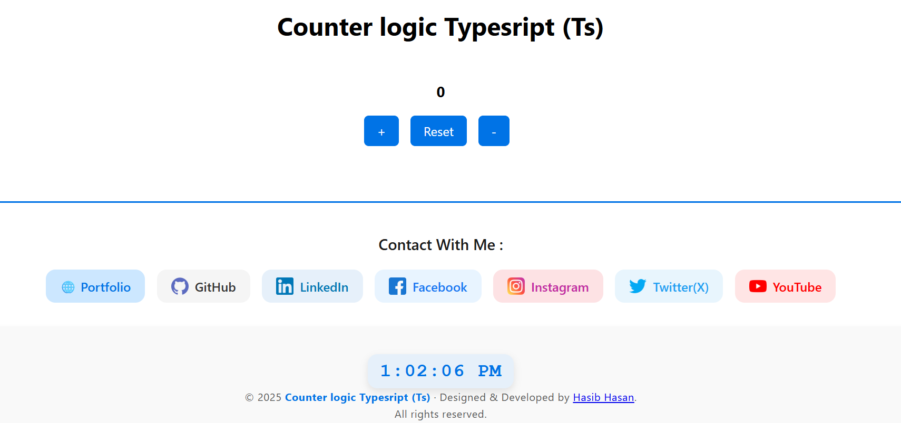
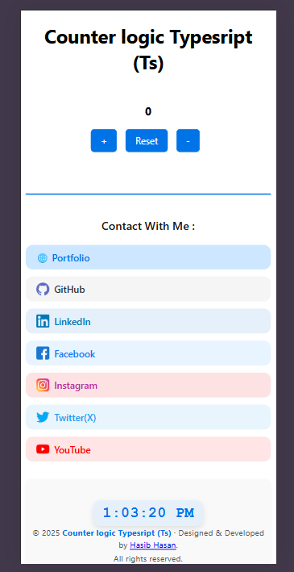

## 1️⃣ npm init
```
npm init -y
```
### 2️⃣ TypeScript install
```
npm install typescript --save-dev
```
### 3️⃣ TypeScript config generate
```
npx tsc --init
```

### 4️⃣ Compile & run
```
npx tsc --watch
```


📁 Project Structure

```
counter-logic-TypeScript/
│
├── src/
│   ├── script.ts            # TypeScript 
│   └── assets/
│       └── screenshot1.png   # preview image for README
│       └── screenshot2.png 
│       └── screenshot3.png     
│       └── screenshot4.png                                   
├── dist/
│   └── script.js            # compiled JS
│
├── index.html               # main HTML file
├── style.css                # styling
├── tsconfig.json            # TypeScript config
├── package.json             # npm project config
├── vite.config.ts           # optional,
└── README.md                # project README with preview + link
```




### 🎯 Why This Project

This project was built to strengthen my TypeScript basics and understand how simple UI logic becomes more reliable with proper typing.

Strong developers are built from strong fundamentals.

### ❤️Final Note

This is a learning-focused project, intentionally kept simple.
